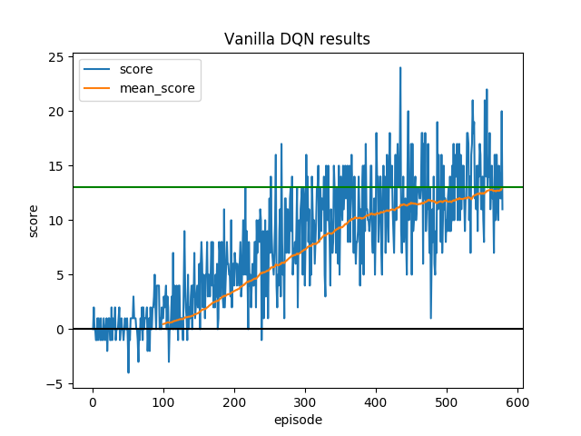
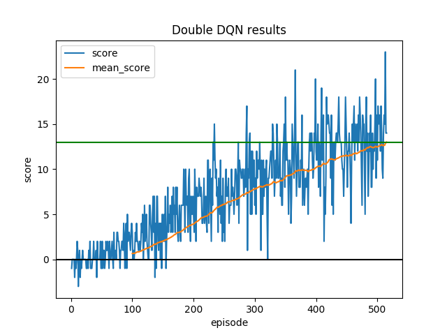
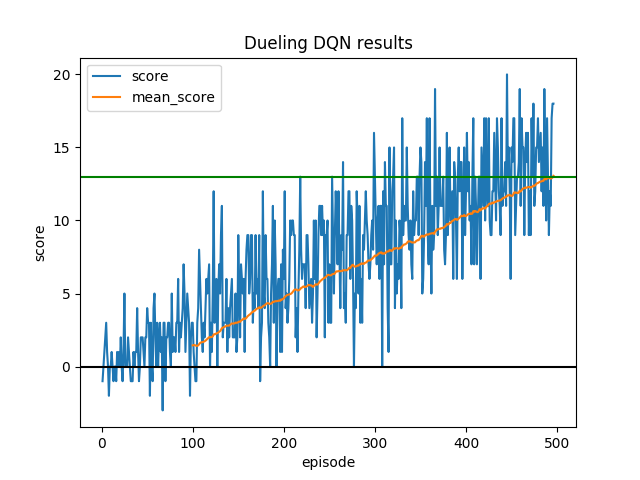

[image1]: https://user-images.githubusercontent.com/10624937/42135619-d90f2f28-7d12-11e8-8823-82b970a54d7e.gif "Trained Agent"

## Udacity Deep Reinforcement Learning Nanodegree

## Project 1: Navigation

Project of module-2 value based methods.

### Project problem statement

![Trained Agent][image1]

A reward of +1 is provided for collecting a yellow banana, and a reward of -1 is provided for collecting a blue banana.  Thus, the goal of your agent is to collect as many yellow bananas as possible while avoiding blue bananas.  

The state space has 37 dimensions and contains the agent's velocity, along with ray-based perception of objects around agent's forward direction.  Given this information, the agent has to learn how to best select actions.  Four discrete actions are available, corresponding to:
- **`0`** - move forward.
- **`1`** - move backward.
- **`2`** - turn left.
- **`3`** - turn right.

The task is episodic, and in order to solve the environment, the agent must get an average score of +13 over 100 consecutive episodes.

Environment description - 
```
Number of Visual Observations (per agent): 0
Vector Observation space type: continuous
Vector Observation space size (per agent): 37
Number of stacked Vector Observation: 1
Vector Action space type: discrete
Vector Action space size (per agent): 4

```
### Learning Algorithm

For this project value-based methods are used, specifically Deep Q learning.
Deep Q learning algorithms use a deep neural network to approximate the Q-value function.
Since in this project image input from the environment isn't, there is no need to use 
convolutional neural nets. Fully connected networks will be used for all implementations.

Parameters used for all runs - 
```
batch_size	64	
buffer_size	100000.0	
eps_decay	0.995	
eps_end	        0.01	
eps_start	1.0	
gamma	        0.99	
lr	        5.0e-4	
max_episodes	2000
```
#### 1. Vanilla DQN

For the Vanilla DQN implementation a neural net with 3 fully connected layers is used.
```
QNetworkSimple(
  (fc1): Linear(in_features=37, out_features=128, bias=True)
  (fc2): Linear(in_features=128, out_features=64, bias=True)
  (fc3): Linear(in_features=64, out_features=4, bias=True)
)
```
Experience relay and fixed Q-targets have been implemented in the code. 
All training parameters (including hidden layer size) can be changed using 
the config json file.

#### 2. Double DQN
Double DQN handles the problem of overestimating Q-values. 
In Double DQN -
1. The `local DQN network` is used to select the best `action` for `next_state`.
2. The `target DQN network` is used to calculate the target `Q value` 
of taking that `action` at the `next_state`.

> Q<sub>target</sub> = r(s, a) + \gamma * Q(s<sup>\'</sup>,
 argmax<sub>a</sub>Q(s<sup>'</sup>, a, \theta<sup>target</sup>), 
 \theta<sup>local</sup>)
 
 
 
```
QNetworkSimple(
  (fc1): Linear(in_features=37, out_features=128, bias=True)
  (fc2): Linear(in_features=128, out_features=64, bias=True)
  (fc3): Linear(in_features=64, out_features=4, bias=True)
)
```

#### 3. Dueling DQN
Q-values `Q(s,a)` can be decomposed as a sum of:
- `V(s)`: the value of being at that state
- `A(s, a)`: how much better this action is compared to all other actions 
in this state

> Q(s, a) = A(s, a) + V(s)

In Dueling DQN, these two elements are separately estimated by the same neural network.
The base network bifurcates into two streams that estimate these two values.

In the code implementation, the below mentioned formula is used for estimating
Q values. By subtracting the mean of advantage values stability of optimization 
is increased, as the advantages only need to change as fast as the mean.

> Q(s, a) = V(s) + A(s, a) - mean(A(s, :))

Dueling DQN can learn which states are valuable and which are not. This is 
useful for knowing states where actions do not effect the environment in a
relevant way. This helps in accelerating training and finding more reliable 
Q values for each action by decoupling the estimation between two streams.
Network definition-

```
QNetworkDueling(
  (fc1): Linear(in_features=37, out_features=128, bias=True)
  (fc2): Linear(in_features=128, out_features=64, bias=True)
  (fc2_val): Linear(in_features=64, out_features=64, bias=True)
  (fc3_val): Linear(in_features=64, out_features=1, bias=True)
  (fc2_adv): Linear(in_features=64, out_features=64, bias=True)
  (fc3_adv): Linear(in_features=64, out_features=4, bias=True)
)

val is the value estimation branch.
adv is the advantage estimation branch
```

### Code description
The code consists of the following files and packages:
- main.py: The file to run to perform training and evaluation. (instructions in README)
- navigationrl: package containing code for agents, models and utils.
- navigationrl/agents: package consists of base abstract class for agents and 
a dqn agent.
- navigationrl/models: package contains Qnet classes and a factory class for instantiating
Q network objects.
- navigationrl/utils: contains replay buffer class.

### Results

#### 1. Vanilla DQN



Goal achieved in 579 episodes.

#### 2. Double DQN



Goal achieved in 515 episodes.

#### 3. Dueling DQN



Goal achieved in 496 episodes.

### Conclusion
All models solved the problem without much hyperparameter tweaking and acheived +13 average rewards. Improvements are observed in the performance by using double dqn and dueling dqn( lesser number of training episodes are required for goal completion).
### Ideas for future work

- Prioritized experience replay. [paper](https://www.google.com/url?sa=t&rct=j&q=&esrc=s&source=web&cd=2&cad=rja&uact=8&ved=2ahUKEwj2-NGu9e7hAhWOiHAKHXhIDvQQFjABegQIARAB&url=https%3A%2F%2Farxiv.org%2Fabs%2F1511.05952&usg=AOvVaw3Qk4Ho4LfiFn4eFYLh7Dei)
- Noisy Networks for exploration. [paper](https://www.google.com/url?sa=t&rct=j&q=&esrc=s&source=web&cd=1&cad=rja&uact=8&ved=2ahUKEwj08OOZ9e7hAhUTk3AKHX4XDN4QFjAAegQIBhAB&url=https%3A%2F%2Farxiv.org%2Fabs%2F1706.10295&usg=AOvVaw0VYyGduIZU_xzgCmS_AWJk) 
- RAINBOW. [paper](https://www.google.com/url?sa=t&rct=j&q=&esrc=s&source=web&cd=1&cad=rja&uact=8&ved=2ahUKEwjY6tS79e7hAhXYh3AKHWIFB0EQFjAAegQIBRAC&url=https%3A%2F%2Farxiv.org%2Fpdf%2F1710.02298&usg=AOvVaw1AAP9avRplDeK9MPiZgu-Y)
- Grid search and Bayesian optimization for hyperparameter search.